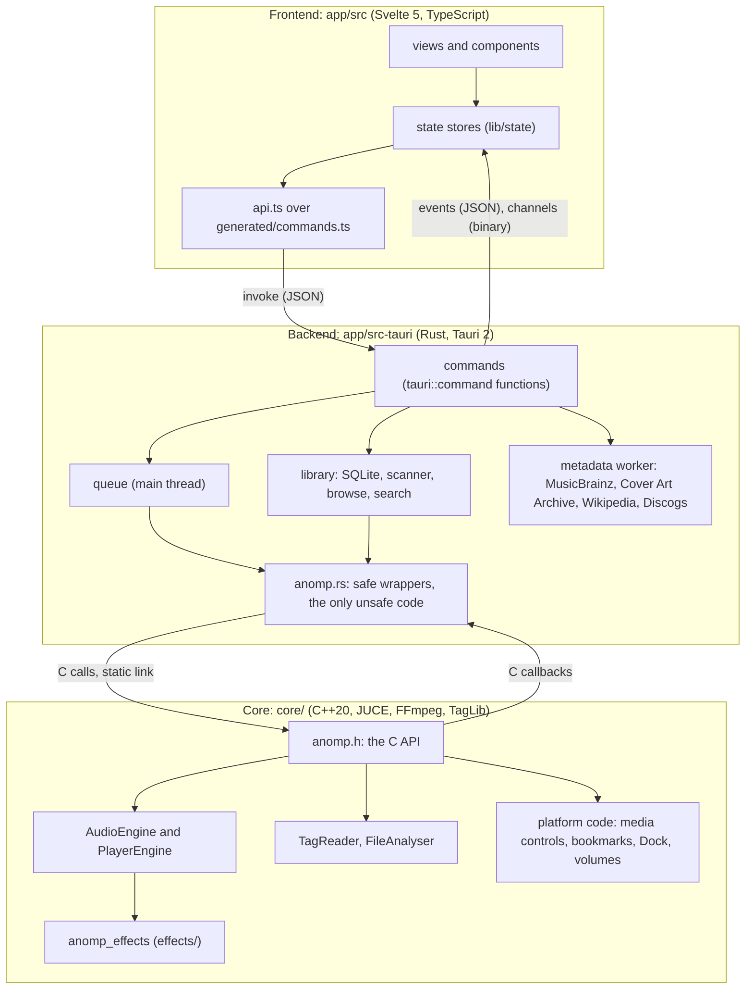
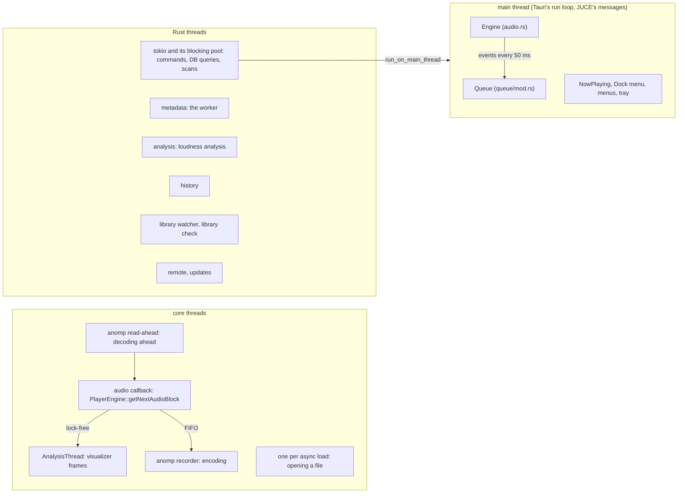

# 1. Overview

ano-mp is one process with three layers: a C++ audio core, a Rust
backend, and a web frontend drawn by the system's webview. This chapter
says what each layer owns, how they talk, which thread runs what, and
what happens to a track between the file and the speaker. Everything
after it builds on these four ideas.

## The three layers

- **The core** (`core/`, `anomp_core`) does what must be fast or close to
  the OS: decoding (FFmpeg, every format), playback with gapless
  hand-offs and crossfades, tags (TagLib), the visualizer's analysis,
  recording, and the platform services (Now Playing, security-scoped
  bookmarks, the Dock menu, volume mounts). JUCE supplies the audio
  device, resampling and its message loop. The real-time effects are a
  library of their own (`effects/`) that the core links privately.
  [Chapter 4](04-core.md), [chapter 5](05-effects.md).
- **The backend** (`app/src-tauri/`) owns everything else: the library
  database, settings, the play queue, folder scanning, online metadata,
  history, menus and windows, logging. It is the only caller of the
  core. [Chapter 6](06-rust-backend.md).
- **The frontend** (`app/src/`) is what the user sees: it asks the
  backend for data and actions through Tauri commands and follows its
  events. It never touches files, the network or the core directly.
  [Chapter 7](07-frontend.md).

`PLAN.md` §1 records why the layers are split this way. The short form:
Rust's crates are mature for SQLite, HTTP and JSON, so the C++ side stays
small and testable; and the boundary between them is plain C because it
is the simplest stable interface both sides can test.

## Why the core is a static library

The core is compiled into the app's own executable. Rust's build script
(`app/src-tauri/build.rs`) builds it with CMake through the `cmake` crate
and links it, with the effects library and TagLib, as static libraries;
FFmpeg is linked as shared libraries (the LGPL requires that they stay
replaceable) and embedded in the app bundle.

It is not a helper process ("sidecar") because iOS forbids apps from
starting other processes, and the design has to work on every platform
the plan targets. A static library also means no IPC on the audio path:
a call into the core is an ordinary function call.

## One C API

`core/include/anomp/anomp.h` is the core's whole public surface. It is
plain C: functions, `typedef struct`s, enums as `int`s, UTF-8 strings,
and callbacks with a `void* user_data`. No C++ type and no exception
crosses it; `anomp_c_api.cpp` catches everything and reports failures as
return values and error strings. Everything in `core/src` is private.

On the Rust side, `app/src-tauri/src/anomp.rs` declares each C function
once and wraps it in a safe Rust type (`Engine`, `Tags`, `FolderAccess`,
`MediaControls`, `DockMenu`…). It is the only file with `unsafe` code
that calls the core. `scripts/check-c-api.py` checks that every function
in the header is bound there with the same number of parameters.

The conventions (who frees what, how errors come back, which thread may
call) are in [chapter 4](04-core.md#the-c-apis-conventions).

## Who owns which thread

Most bugs that are hard to find in an audio app are threading bugs, so
ano-mp keeps strict rules about which thread does what. The main thread
is the centre: JUCE's message loop rides on the main run loop that Tauri
runs, so the engine, the queue and the OS's media controls all live
there.

| Thread | Runs | Rule |
|---|---|---|
| main | the engine, the queue, media controls, the Dock menu, menus and windows | every `anomp_engine_*` call is made here, and engine events arrive here; `audio::with_engine` hops here if needed |
| audio callback (CoreAudio's) | `PlayerEngine::getNextAudioBlock`: mixing, effects, equaliser, crossfeed, volume | never allocates, locks, opens or frees a track |
| `anomp read-ahead` | each track's `BufferingAudioSource` decoding ahead of playback | shared by the current and next track |
| one per asynchronous load | `PlayerEngine::loadAsync`: opening a file and filling its read-ahead | handed over on the main thread |
| `AnalysisThread` | the visualizer's analysis, calling Rust's callback | never the main thread |
| `anomp recorder` | encoding a recording | everything that can wait or fail happens here, not on the audio thread |
| tokio's blocking pool | commands' database work (`on_library`), scans, opening a track's folder | never holds the library connection while waiting for the main thread |
| `metadata` | the metadata worker: every online request | other threads only queue work for it |
| `anomp-workbench-take` (short-lived) | ending an effects workbench take: waits for the loop's end, then stops the recording | hops to the main thread for the recording and the queue |
| `analysis`, `history`, `library watcher`, `library check`, `remote`, `updates` | each one job, named after it | each owns its own database connection where it needs one |

Two consequences shape much of the Rust code:

- **The engine and the queue are `thread_local`s on the main thread.**
  A command that needs the database first does that on a blocking
  thread, then hops to the main thread with the result (`queue::run`).
  Waiting for the main thread while holding the library's connection
  would deadlock as soon as the main thread wanted the connection.
- **Opening a file never blocks the main thread** (H11). A file can take
  seconds to open (a disk spinning up, a network share, a cloud file
  downloading), so the queue asks for it and is told later
  ([chapter 8](08-flows.md#pressing-play-on-a-track)).

`CLAUDE.md`'s "The engine is main-thread only" and "Files open off the
main thread" are the rules; [chapter 6](06-rust-backend.md#the-engine-on-the-main-thread)
explains the code that keeps them.

## A track's journey

From the click on a track to sound, and to the visualizer:

```mermaid
flowchart LR
    Click["click in BrowsePane"] --> Cmd["queue_play_node"]
    Cmd --> Rows["track rows (blocking thread)"]
    Rows --> QM["Queue::replace (main thread)"]
    QM --> Open["opening::ask: row, folder bookmark (blocking thread)"]
    Open --> LoadAsync["Engine::load_track_async (main thread)"]
    LoadAsync --> Reader["FFmpegAudioFormat reader (opening thread)"]
    Reader --> Buffer["BufferingAudioSource (read-ahead thread)"]
    subgraph AudioThread["audio callback"]
        Buffer --> Gain["track gain (ReplayGain)"]
        Gain --> Join["join with the next track / crossfade"]
        Join --> Stretch["time-stretch (practice mode)"]
        Stretch --> Resample["resample to the device rate"]
        Resample --> Fx["EffectChain"]
        Fx --> Tap["SignalTap"]
        Tap --> EQ["Equaliser"]
        EQ --> XF["Crossfeed"]
        XF --> RecTap["Recorder FIFO"]
        RecTap --> Vol["volume"]
    end
    Vol --> Device["output device"]
    Tap --> Analysis["AnalysisThread"] --> Channel["visualizer.rs: binary frames"] --> Canvas["Visualizer.svelte canvas"]
```

1. The UI calls a command (`queue_play_node`) with the browse node and
   the track clicked.
2. Rust reads the tracks' rows on a blocking thread, then replaces the
   queue on the main thread.
3. The queue asks `queue/opening.rs` to open the first track: on a
   blocking thread it reads how to play the track
   (`library::playback::track_play`: its file, the part of the file, its
   gain) and resolves the folder's bookmark, then hands the file to the
   engine on the main thread.
4. The core opens the file on a thread of its own with FFmpeg, fills its
   read-ahead buffer, and hands the track over at its next event
   dispatch, reporting `LoadFinished`.
5. On the audio thread, the track's samples are scaled by its gain,
   joined to the next track at the file's sample rate (so the hand-off
   is sample-exact), resampled once to the device's rate, passed through
   the effects, tapped for the visualizer, equalised, crossfed, recorded
   and finally scaled by the volume.
6. Every 50 ms the engine reports its position and state on the main
   thread; the queue, Now Playing, the history and the UI follow.
7. While a visualization is showing, the core's analysis thread reads
   the tap and sends frames through Rust to the page's canvas.

[Chapter 8](08-flows.md) follows this and the other main actions
function by function.

## Where to go next

- To build and run it: [Getting set up](02-getting-set-up.md).
- To find a file: [Repository map](03-repository-map.md).
- To understand a part: chapters 4 to 7.
- To fix something: [Troubleshooting](10-troubleshooting.md).
