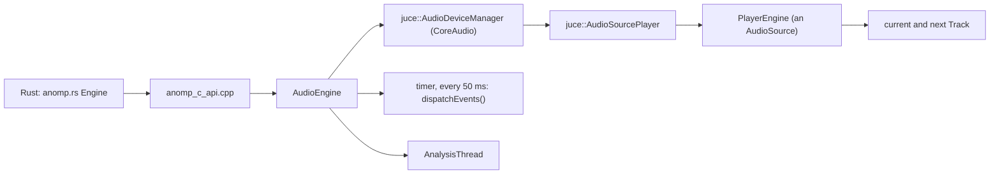
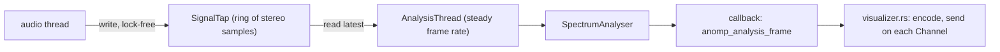

# 4. The core

`anomp_core` (`core/`) is a C++20 static library built on JUCE, FFmpeg
and TagLib. It decodes and plays audio, reads tags, analyses what plays,
records it, and wraps the OS services the app needs. This chapter walks
through its parts in the order a track meets them, then the platform
code, logging, and the conventions of its C API.

Its code follows JUCE's style (the `anomp` namespace, `juce::` qualified
everywhere, Allman braces, a space before argument lists); the
formatter (`scripts/format-cpp.py`) and clang-tidy (`scripts/lint-cpp.py`)
keep it so, and `juce_recommended_warning_flags` keeps it warning-clean.
Every source file is listed by hand in `core/CMakeLists.txt`, with the
platform files chosen there by OS (`check-sources.py` compares the list
with the disk).

## The engine: `AudioEngine` and `PlayerEngine`

**`AudioEngine`** (`core/src/AudioEngine.h`) is what Rust's `Engine`
holds. It owns:

- JUCE's runtime (`JuceRuntime`, its first base class, so it is shut
  down last, after everything else in the engine);
- the format registry and the shared read-ahead thread (`anomp
  read-ahead`);
- the `PlayerEngine`;
- the device manager and the `AudioSourcePlayer` that pulls audio from
  the player on the device's callback;
- the visualizer's `AnalysisThread`, while one runs.

It opens output devices (the default, or one by name with a buffer
size), switches the device's sample rate when asked (O10), reports
device changes (`onDeviceChanged`), says whether the output is
headphones (`OutputRoute`), and plays a test tone in place of the player.
A timer calls `PlayerEngine::dispatchEvents` every 50 ms, and an
`AsyncUpdater` calls it at once when an asynchronous load is ready.
Everything about it is main-thread only: JUCE delivers its messages on
the main run loop, which Tauri runs.

**`PlayerEngine`** (`core/src/PlayerEngine.h`) is the player itself, a
plain `juce::AudioSource` with no device. Tests render it offline by
calling `getNextAudioBlock` directly (`core/tests/PlayerEngineTests.cpp`),
with or without a read-ahead thread. It holds:

- the **current track** and one pre-opened **next track**. Each `Track`
  is an `AudioFormatReaderSource` behind a `BufferingAudioSource` that
  decodes about three seconds ahead on the read-ahead thread, with its
  `TrackOptions`: its gain (ReplayGain, applied as it is read), the part
  of the file it is (`start`, `end`, for cue sheets and chapters), a
  silence to skip once (`skipFrom`, `skipTo`) and, for a next track, a
  crossfade length;
- the signal path's stages: a time-stretcher (practice mode, Signalsmith
  Stretch), one windowed-sinc resampler to the device rate, the
  `fx::EffectChain`, the `SignalTap`, the `Equaliser`, the `Crossfeed`,
  the `Recorder` and the volume;
- the transport's state (`empty`, `stopped`, `playing`, `paused`), an
  A–B loop, and the events to report.

### The signal path

Per audio block, on the audio thread:

1. The current track's samples are read at the file's own rate, scaled
   by its gain. At its end the next track continues in the same block
   (the **gapless hand-off**), or, over the last seconds, both are read
   and mixed with equal-power curves (the **crossfade**).
2. While practising, the stretcher changes tempo and pitch.
3. The resampler converts to the device's rate once, for the joined
   stream, which is why a hand-off is sample-exact whatever the device
   runs at. When the rates match it is bypassed and playback is
   bit-exact.
4. The effects run (chapter 5), so the visualizer sees what they make.
5. The `SignalTap` keeps the latest samples for the analysis thread.
6. The equaliser, then crossfeed.
7. The recorder copies the block into its FIFO (before the volume, so a
   recording doesn't follow the volume slider).
8. The volume, ramped over the block. Play and pause fade over one block;
   stop, seek and load cut.

### Gapless hand-off and crossfade

The core never decides what plays next: the host owns the queue. It sets
a next track (`setNext`, or `setNextAsync`), and when the current one
ends the player continues into it within the same block and reports
`onTrackEnded (true)` at the next dispatch; the host then sets the
following one. If there is no next track, playback stops and it reports
`onTrackEnded (false)`.

Tracks at different sample rates can't be joined sample-exactly, so they
switch at the next chunk boundary, leaving a few milliseconds of silence.
A crossfade happens only between tracks at one rate and never while an
A–B loop is on; the host chooses which hand-offs crossfade (none within
an album: `queue/model.rs`). The effects run on across hand-offs, so a
reverb's tail carries into the next track; a held spectral freeze lets
go.

A track the audio thread retires (after a hand-off) is freed at the next
dispatch on the main thread. Tracks are never opened or freed on the
audio thread.

### Loading off the main thread

`load` and `setNext` open the file on the calling thread; they remain
for tests and the /dev page. The app uses `loadAsync` and `setNextAsync`
(H11): each starts a thread that opens the file and fills its
read-ahead, then signals `onLoadReady`, and the next dispatch hands the
track over on the main thread and reports `onLoadFinished` with the
request's id (loaded, failed, or cancelled). Requests take effect in the
order they were made; a load cancels earlier ones; `cancelLoad` drops
one. The host must keep the file's folder accessible until the request
is reported, which `queue/opening.rs` does.

`docs/design/phase-1-playback-engine.md` explains why there is no
`AudioTransportSource`, how the resampler was chosen, and the engine's
known limits (files with more than two channels play their first two).

## Decoding: `FFmpegAudioFormat`

FFmpeg decodes every format on every platform (`PLAN.md` §4.3). The core
wraps it as one read-only JUCE `AudioFormat` (`core/src/FFmpegAudioFormat.h`),
registered alone in `FormatRegistry`, so everything after it sees an
ordinary `juce::AudioFormatReader` and knows nothing of FFmpeg.

- Every read goes through an `AVIOContext` over a `juce::InputStream`, so
  files, bookmarked folders and memory all take one path.
- Output is float at the file's own rate. Positions count from the first
  decoded sample; libavcodec already trims encoder delay and padding,
  which makes MP3, AAC and Opus gapless.
- The **length** is the smaller of the header's and the measured end of
  the decoded output (the last two seconds are decoded on open).
- **Seeking** seeks to before the target by a preroll, then decodes and
  discards up to it; near either end it rewinds instead, and rewinding
  reopens the demuxer. MP3 and raw AAC get an exact seek index on open.

Read the Phase 1 design notes before changing the reader: each of these
rules fixes a real file's misbehaviour. Only `FFmpegAudioFormat.cpp` and
`FFmpegEncoder.cpp` include FFmpeg's headers. FFmpeg itself is built by
`scripts/build-ffmpeg.sh` with only the demuxers, decoders and parsers
the app plays, and `core/tests/FFmpegBuildTests.cpp` checks that list
exactly; adding a format is a change to both (chapter 11).

## Tags: `TagReader`

`TagReader` (`core/src/TagReader.h`) reads a file's tags with TagLib
(built with only the formats FFmpeg plays, `cmake/TagLib.cmake`), and its
audio properties, falling back to the decoder where TagLib can't. It
returns one `Tags` value: the usual fields (several values joined with
"; "), ReplayGain (Opus's R128 gains converted), MusicBrainz ids,
classical works and movements, dates, a rating, the compilation flag,
the ARTISTS list and, when asked (`ANOMP_TAGS_*` flags), the embedded
picture, lyrics, chapters and an embedded cue sheet. `TagReader` also
lists every raw field and picture for Get Info (`anomp_read_file_info`).

It never writes to a file, and it is safe on any thread, concurrently:
the scanner reads many files in parallel.

## Analysis for the visualizer

- `SignalTap` keeps the latest stereo samples the player rendered (after
  the effects, before the equaliser and the volume), written by the audio
  thread and read without locks.
- `AnalysisThread` runs only while the host has set a callback
  (`anomp_engine_set_analysis_callback`). At the configured frame rate it
  asks the `SpectrumAnalyser` for a frame and calls the callback **on its
  own thread**: the callback must not call the engine.
- `SpectrumAnalyser` computes the bands (log-spaced, tilted so music
  looks level), chroma (energy per pitch class), notes, per-band stereo
  balance, peak and RMS levels, a waveform starting at a rising zero
  crossing, and beats (at most four a second). After 150 ms of silence it
  sends one silent frame and waits.

## Analysing files: `FileAnalyser`

The loudness analysis (O1) and what it finds for the waveform seek bar,
silences, segues and the health report are measured by `FileAnalyser`
(`core/src/FileAnalyser.h`), one pass over a file with its own reader,
never through the engine: EBU R128 integrated loudness and its
histogram, sample and true peaks, leading, trailing and inner silences,
the levels at either end, the spectrum's cutoff (a sign of a lossy
source), and the seek bar's envelope. Rust's `library/analysis.rs` runs
it on a background thread, a few tracks at a time.

## Recording: `Recorder` and `FFmpegEncoder`

Recording (X6) takes what the player renders, after crossfeed and before
the volume. The audio thread only copies each block into the recorder's
lock-free FIFO (`Recorder::push`), and marks where tracks begin; it never
waits. A writer thread (`anomp recorder`) drains the FIFO into the
encoder (`FFmpegEncoder`: WAV, AIFF, FLAC, ALAC, AAC or MP3 through
LAME). If the FIFO is full the block is dropped and counted as an
overrun. A write error or a full disk stops the writer, which finalises
what it wrote and reports the failure through
`ANOMP_EVENT_RECORDING_FAILED`. A change of sample rate starts a new
file ("name 2.wav").

## Platform code

The core keeps every OS call behind a small interface with one
implementation per platform, chosen in `core/CMakeLists.txt`: the
`_apple` files on macOS and iOS (Objective-C++ compiled with ARC), and
`_none` or `_unsandboxed` files elsewhere until the Linux and Windows
phases add real ones. Code outside these files never calls AppKit,
CoreAudio or Media Player.

| Interface | What it does | Apple implementation |
|---|---|---|
| `FolderAccess` | create a security-scoped bookmark for a folder the user picked; resolve it later and keep the folder readable while the result lives | `NSURL` bookmarks (read-only, or writable for recordings) |
| `FileStatus` | whether a file is a dataless cloud placeholder, without downloading it | `stat()`'s `SF_DATALESS` flag |
| `MediaControls` | publish what plays (title, artist, album, artwork, position) and receive play, pause, next, previous and seek | `MPNowPlayingInfoCenter`, `MPRemoteCommandCenter` |
| `DockMenu` | the Dock icon's menu | adds `applicationDockMenu:` to the host's app delegate at run time |
| `OutputRoute` | whether the output device is headphones | CoreAudio's data source and transport type |
| `VolumeWatcher` | drives, disk images and shares mounting and unmounting | `NSWorkspace` notifications |

`MediaControls` and `DockMenu` keep the platform-neutral part (the state
published, which commands are allowed) in the base class, and the OS part
in a `Backend`, so the tests check the logic with no OS behind it.

## Logging: `Log`

The core logs through `anomp::log::error`, `warn`, `info` and `debug`
(`core/src/Log.h`), which go to the host's callback
(`anomp_set_log_callback`); Rust writes them to the app's log with the
target "core". JUCE's `Logger` messages and failed `jassert`s (in every
build) arrive there too. The callback may be called on the audio thread,
so it must return quickly.

Anything in the core that outlives JUCE's runtime at exit (a static, a
base class of `AudioEngine`) must let go of JUCE first, or quitting
aborts; `Log.cpp` shows how.

## The C API's conventions

`core/include/anomp/anomp.h` is the core's only public surface, and
`core/src/anomp_c_api.cpp` its only implementation. These rules hold for
every function:

- **Plain C.** No C++ types, references or exceptions cross it. Every
  function catches everything and turns it into its return value; `bool`
  becomes `int` (1 or 0), enums are `int` constants (`ANOMP_*`).
- **Strings are UTF-8 and NUL-terminated**, never null in a result (""
  when absent). Paths are absolute.
- **Errors**: a function that can fail takes `char* error, size_t
  error_size` and writes its message there, truncated to fit (`error`
  may be null). It returns 0, null or a negative value on failure, as its
  comment says.
- **Ownership**: a function that returns a struct pointer
  (`anomp_read_tags`, `anomp_bookmark_create`, `anomp_engine_create`…)
  gives it to the caller, who frees it with the matching `*_free` or
  `*_destroy`; null is always safe to free. Pointers inside a result live
  as long as the result. Data passed in is copied before the call
  returns.
- **Null handles are safe**: passing a null engine, controls or menu does
  nothing and returns the failure value.
- **Threads**: the tag, file-info, analysis, bookmark and file-status
  functions may be called from any thread, concurrently. Every
  `anomp_engine_*`, `anomp_media_controls_*` and `anomp_dock_menu_*`
  function is main-thread only.
- **Callbacks** take a `void* user_data` that the core passes back
  untouched; the data they receive is valid only during the call. Engine
  events arrive on the main thread, at a dispatch, never from inside an
  engine call, and their handler may call the engine (to set the next
  track after `ANOMP_EVENT_TRACK_ENDED`), but not destroy it or replace
  the handler. The analysis callback runs on the analysis thread and must
  not call the engine. The log callback runs on whichever thread logs.

On the Rust side, `anomp.rs` turns each of these into safe Rust: owned
results into types with `Drop`, error buffers into `Result<_, String>`,
callbacks into boxed closures registered as `user_data` (double-boxed so
the C side holds a thin, stable pointer). The `Engine` type is `!Send`,
so the compiler keeps it on the thread that made it. Adding a function
is a recipe in [chapter 11](11-recipes.md#a-c-api-function).

## Tests

`core/tests/` holds the Catch2 suite, one file per area (decoding,
tags, the player, analysis, recording, folder access, media controls,
the C API, FFmpeg's build), registered with CTest one test case each.
The fixtures are small files that all encode one deterministic chirp;
[chapter 12](12-testing.md) explains them and the fuzz targets in
`core/fuzz/`.
