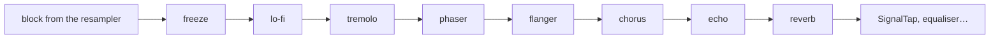
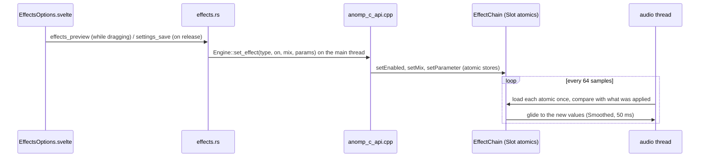

# 5. Effects

The real-time effects (X2: reverb, chorus, spectral freeze, echo,
flanger, phaser, tremolo and lo-fi) are a library of their own,
`anomp_effects` (`effects/`), in plain C++20 with no dependencies, JUCE
included. It builds, tests and benchmarks alone, ports with nothing
else, and the core links it privately: nothing in the core but
`PlayerEngine` and the C API knows the effects exist.

The effects are behind the `effects` feature switch, off by default
because they change what is heard; with the switch off every effect is
off whatever its settings say (`effects.rs`).

## The chain

`effects/include/anomp/effects/EffectChain.h` is the library's only
public header. It holds:

- **the catalogue**: `EffectType` (stable numbers: the C API passes
  them), and for each effect an `EffectInfo`: its id (`"reverb"`, the
  settings' key), its default mix, and up to four parameters
  (`ParamInfo`: id, unit, range, default, whether a slider should be
  logarithmic). `describe` and `typeOf` look entries up. Rust reads the
  catalogue through `anomp_effect_describe`, so the settings, their
  validation and the UI's sliders all follow it;
- **`chainOrder`**: the fixed order the effects run in: the freeze first
  (it sees the music as it is), then lo-fi, tremolo, phaser, flanger and
  chorus, then echo and reverb last, so their tails carry everything
  before them;
- **`EffectChain`**: one `Slot` per effect, run in that order over a
  stereo signal in place.

Each slot sends the chunk into its effect, which turns it into the wet
signal in place (`Effect::process`, `effects/src/Effect.h`), and the
chain mixes: `out = dry × (1 − mix) + wet × mix`. An effect never mixes
for itself, which keeps each one simple and testable on its own.

## How settings reach the audio thread

- Every setting is a `std::atomic` in its slot (`enabled`, `mix`,
  `params`), set from any thread without a lock. The audio thread reads
  each once per chunk of `chunkSize` (64) samples, so a change takes
  effect within a chunk and nothing ever waits.
- Nothing jumps: the mix and the switches glide over `glideSeconds`
  (50 ms) through `dsp::Smoothed`, and each effect smooths its own
  parameters, so dragging a slider while music plays never clicks.
- **Switching on**: the effect starts from silence (`reset`), takes its
  parameters as they are (`snap`), and its wet signal fades in.
- **Switching off**: the effect stops taking input at once, the dry
  signal glides back to full, and the wet one stays until the effect's
  tail (`tailSeconds`: a reverb's decay, an echo's repeats) has died
  away; then the slot stops running and costs nothing.
- Settings are clamped to their ranges as they are stored; NaN leaves a
  value as it was.

The spectral freeze has one more control: **Hold**. `setFreezeHeld
(true)` holds the sound of the moment while the freeze is on, and
`trackChanged` (a new track taking over, or another loaded) lets go of
it, while other effects' tails carry on into the new track. The UI asks
the engine again whenever the track changes (`state/effects.svelte.ts`).

## The bit-identical rule

With every effect off, the signal must come out of `process` exactly as
it went in: not "close", bit for bit. The chain skips a slot that isn't
running, and a slot that has finished its tail stops running, so the
cost and the effect on the sound both drop to nothing. `ChainTests.cpp`
checks this, and the core's player tests rely on it (bit-exact playback
and gapless hand-offs are tested with the effects present but off).

## On the Rust and UI side

- `app/src-tauri/src/effects.rs`: `EffectsSettings` (one
  `EffectSettings` per effect: `enabled`, `mix`, `params` by id) inside
  `AppSettings`, validated against the core's catalogue; `apply_to`
  passes them to the engine; the commands `effects_catalog`,
  `effects_preview` (apply without saving, for a slider being dragged),
  `effects_freeze` and `effects_status`.
- `app/src/lib/effects.ts`: the presets and the sliders' scales, pure and
  tested (`tests/effects.test.mjs`).
- `lib/components/settings/EffectsOptions.svelte`: Settings › Effects.
- The signal path panel (`SignalPathPanel.svelte`) shows which effects
  are on or still ringing out (`isActive`).

## Adding an effect

`CLAUDE.md`'s **Effects** rule lists the places; in order:

1. **The effect.** A class deriving from `Effect` in `effects/src/`
   (a new file goes in `effects/CMakeLists.txt`), built from `Dsp.h`'s
   pieces: it smooths its own parameters, allocates only in `prepare`,
   and reports its `tailSeconds`.
2. **The catalogue.** A value at the **end** of `EffectType` (the numbers
   are stable), `effectCount` raised, its `EffectInfo` in
   `EffectChain.cpp`'s `catalogue` (same position), a case in `create`,
   and its place in `chainOrder`.
3. **Tests** in `effects/tests/`: what it does to a known signal, that it
   is silent after its tail, that it doesn't click when switched, at
   every sample rate `EffectTests.cpp` covers.
4. **The C API.** An `ANOMP_EFFECT_*` value in `anomp.h` matching its
   number, `ANOMP_EFFECT_COUNT` raised, and `EFFECT_COUNT` in
   `anomp.rs` with it (an `effects.rs` test compares it with the
   catalogue). Rust reads everything else from the catalogue.
5. **Rust.** A field in `EffectsSettings` and a case in its `get`
   (`effects.rs`); its tests check every catalogue entry has both.
6. **Text.** `effects.<id>`, `effects.<id>About` and
   `effects.param.<param>` for each new parameter in `en.json`.
7. **The user guide**: the Sound chapter, and regenerate the settings
   reference (`ANOMP_WRITE_BINDINGS=1 cargo test bindings`).
8. **The budget.** Run `scripts/bench.py --only core`: the chain with
   every effect on at 192 kHz (`core.effects.all_192k`) must stay within
   its budget in `scripts/bench-baseline.json`.
