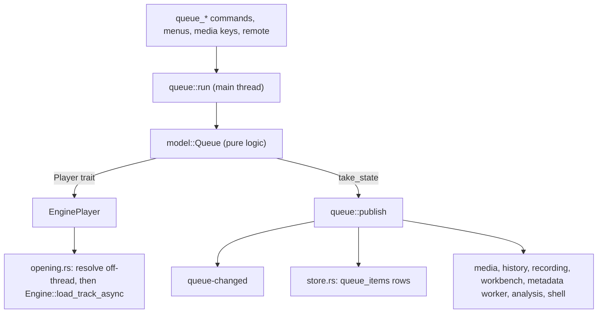
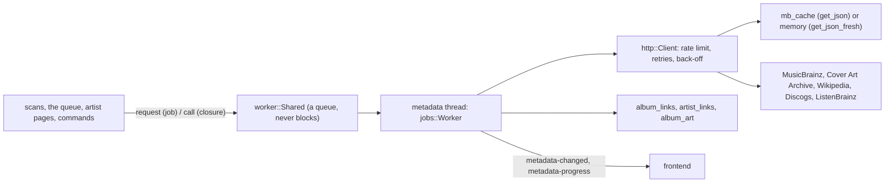

# 6. The Rust backend

`app/src-tauri/` is a Tauri 2 application crate. It hosts the core,
keeps the library database, runs the queue, scans folders, fetches
metadata, and answers the frontend's commands. This chapter explains
each part in the order the app starts them; the
[repository map](03-repository-map.md#the-rust-backend-appsrc-taurisrc)
lists every file.

## How the crate is shaped

Tauri gives the backend three tools, and the code uses each in one way:

- **Commands**: functions marked `#[tauri::command]`, registered in
  `lib.rs`'s `generate_handler!`. The frontend calls them by name with
  JSON arguments (through the generated wrappers in
  `app/src/lib/generated/commands.ts`). A command that touches the
  database runs it on a blocking thread (`library::commands::on_library`),
  and one that touches the engine or the queue hops to the main thread
  (`audio::with_engine`, `queue::run`).
- **Managed state**: values registered once with `app.manage(…)` and
  borrowed by commands as `State<'_, T>` or with `app.try_state::<T>()`:
  `LibraryState` (the shared connection, the art and image caches),
  `SettingsState`, `FolderStates`, `RecoveryState`, the metadata and
  analysis workers, `History`, `RemoteServer`, `Updates`, the menus and
  tray, and `VisualizerState`. The engine and the queue are deliberately
  not managed state: they live in main-thread `thread_local`s.
- **Events**: `app.emit(NAME, payload)` broadcasts to every window. Each
  event's name is a constant next to the code that sends it
  (`queue::QUEUE_CHANGED_EVENT` is `"queue-changed"`), and its payload
  type is in `generated/ipc.ts`. The frontend's `api.ts` lists them all
  in its `Events` map.

Errors: library code returns `library::Error` (`Db` or `Invalid`), the
metadata code `metadata::Error` (`Db`, `Offline`, `Status`, `Invalid`),
and commands return `Result<T, String>`. An error the user should read
and can act on is made with `crate::coded` (`coded.rs`): its string is
JSON with a `code` and `params` that the UI turns into its own words
from `en.json`. A database or I/O failure stays plain English.

## Start-up and shutdown

`lib.rs`'s `run` builds the app. Before Tauri starts it installs the
panic hook, and (with the `self-test` feature) runs the bundle
self-test instead if asked. Then `setup` starts each part in an order
that matters:

| Step | Why here |
|---|---|
| `anomp::forward_core_log` | the core's messages reach the log from the start |
| `library::commands::init` | applies a recovery the user chose last time, opens and migrates the database, registers `LibraryState`; the settings live in it |
| `settings::init` | reads `AppSettings`; they name the output device |
| `audio::init` | creates the engine on the main thread, sets its event handler, opens the device, applies the equaliser, crossfeed and effects |
| `queue::init` | restores the saved queue, paused and not loaded (no file opens until playback is asked for) |
| `media::init` | the OS's Now Playing and media keys, which follow the queue |
| `metadata::worker::init`, `library::analysis::init`, `history::init` | background threads, each with its own connection |
| `remote::init`, `updates::init` | listen or check only if their switches are on |
| `shell::init` | menus, Dock menu, tray: after the queue, which they show |
| `library::watch::init`, `library::commands::upkeep` | last: the launch rescan, file watching, the database check and cache pruning run in the background |

Each step logs its error and carries on, so a broken part doesn't stop
the rest of the app. `RunEvent::Exit` shuts down in roughly the reverse
order, waits up to a second for the history, analysis and metadata
threads (`quitting.rs`; Tauri ends the process soon after the handler
returns), drops the engine last, on the main thread, while the run loop
still exists (JUCE must be shut down there), and makes the process end
before the C++ static destructors run.
[Chapter 8](08-flows.md#quitting) has the details.

## The engine on the main thread

`audio.rs` holds the `Engine` in a main-thread `thread_local`. Three
helpers reach it:

- `with_engine(app, f)`: runs `f` on the main thread (at once when
  already there, otherwise through `run_on_main_thread`, waiting for the
  result). The usual way.
- `on_main(app, f)`: the same for code that needs the main thread for
  other reasons (the queue).
- `engine_mut(f)`: borrows the engine; only on the main thread.

The engine's event handler (set in `audio::init`) is the hub every
playback event passes through: each event goes to `media::player_event`,
then:

| Event | Goes to |
|---|---|
| `DeviceChanged` | reopen the chosen device if it came back, reapply crossfeed and the equaliser (headphones may have changed), `audio-device-changed` |
| `StateChanged` | the shell (Dock and tray), `player-state` |
| `Position` (every 50 ms while playing) | the history's tracker, the queue's sleep timer (`queue::tick`), the effects workbench's take of a loop (`workbench::position`), `player-position` |
| `TrackEnded` | `queue::on_track_ended`, which arms the following track from inside the dispatch, then the workbench's take (`workbench::track_ended`), then `player-track-ended` |
| `LoadFinished` | `queue::on_load_finished` (`queue/opening.rs`) |
| `RecordingFailed` | `recording::failed` |

The output device is the one `settings.output` names, else the default;
while the named one is unplugged the default plays and the named one is
reopened when it returns.

## The queue

The queue is split so that its logic can be tested without an engine,
Tauri or a database:

- **`queue/model.rs`**: `Queue` keeps the list in play order, the
  current item, shuffle (and the order before it), repeat, radio, the
  sleep timer and stop-after, and decides what the engine's current and
  next tracks are. It drives the engine only through the `Player` trait
  (`load`, `set_next`, `play`, `seek`…), which its tests implement with a
  fake. Tracks that belong together (segues, a work's movements, an
  album never to be shuffled) share a `unit` that shuffle keeps whole.
  Every change to the list is logged as an `Edit` (insert, remove, move,
  update) with a new `list_version`, or as a reset; `take_state` hands
  the UI a `QueueState` carrying the edits.
- **`queue/mod.rs`**: hosts the `Queue` in a main-thread `thread_local`.
  `run` is the one way in: on the main thread it borrows the queue and
  the engine (as an `EnginePlayer`), runs the closure, then saves
  positions, schedules the load timeout and `publish`es. Commands that
  need track rows first fetch them on a blocking thread
  (`track_infos`), then call `run`. `publish` sends `queue-changed` and
  tells the media controls, history, recording, the effects workbench, the metadata worker
  (look up the album playing first), the analysis worker (analyse the
  track playing first), radio and the shell.
- **`queue/opening.rs`**: `EnginePlayer::load` doesn't open the file; it
  asks `opening::ask`, which reads how to play the track
  (`library::playback::track_play`) and resolves its folder on a
  blocking thread, then gives the file to the engine on the main thread
  and keeps the folder open until the engine reports it. The queue shows
  the item as loading; `Queue::load_finished` gets the outcome, in
  request order. A request still open after `LOAD_TIMEOUT` fails
  (`check_loads`, run by a timer thread); a cloud placeholder being
  downloaded gets `DOWNLOAD_TIMEOUT`.
- **`queue/store.rs`**: the saved queue's list is rows of `queue_items`
  with sparse sort keys; `Store` applies the same edits the UI gets, so
  a change writes only the rows it touches. The rest (current index,
  position, repeat, shuffle, volume) is the `player.queue` setting.
- **`queue/radio.rs`**: picks tracks like a seed from the library, using
  `library::similar`'s scoring, each with its reasons.

`CLAUDE.md`'s "The saved queue" rule follows from this: a model change
that doesn't log an edit or a reset is invisible to both the UI and the
saved rows.

### The effects workbench's takes

The effects workbench (X8, `workbench.rs`) adds nothing to the engine:
its file is a queue item like a file opened from the Finder
(`queue::open_file`, which shares `open_files`' resolution and returns
the item), or the queue's current item as it is (`workbench_current`,
which reads its file through `queue::read_track_file`, the folder held
open), and a take is X6's recording around it. A file that has left the
queue plays again by its track id (`workbench_reopen`,
`queue::open_track`). `workbench_take` asks
the model to `ready_take` (stop after the item, pause, seek to the start
or the A–B loop's start), starts the recording, keeps a `Take` in a
main-thread `thread_local`, and plays. Four hooks end it: `track_ended`
(playback stopped after the file, so the recording holds exactly the
file), `position` (near the loop's end, a short-lived
`anomp-workbench-take` thread sleeps until it, then stops and pauses),
`queue_changed` (another item became current) and `recording_finished`
(the recording stopped any other way). Ending stops the recording and
calls `Queue::end_take`, which puts back the item playback stopped after
before, unless the user chose another meanwhile. The hooks run inside
the queue's or the engine's turn on the main thread, so the end always
runs on that thread of its own, which then hops back.

## The library

`LibraryState` (`library/commands.rs`) holds one shared SQLite
connection for short queries, behind a mutex. Long work opens its own:
a scan, the workers, the history thread. Every connection is opened
through `library::db`, which configures it and registers the SQL
functions `anomp_sort_key`, `anomp_genres` and `anomp_has_genre` (so
they exist only in this app's connections, and must never appear in the
schema).

**Schema and migrations** (`library/db.rs`, `library/migrations/`): the
schema is the numbered SQL files in `MIGRATIONS`, applied in order;
`PRAGMA user_version` counts those applied. Before migrating a file
database, `db::open` writes a copy (`library.sqlite3.pre-<n>`) and keeps
the newest two; if the copy can't be written, the migration doesn't
run. [Chapter 9](09-data.md) describes every table.

**Folders and access** (`library/access.rs`, `library/availability.rs`):
a folder's row holds its last path and its security-scoped bookmark.
`open_folder` (or `open_folder_of`, for a file) resolves the bookmark and
returns an `OpenFolder` that keeps the folder readable while it lives;
anything that opens a library file holds one until the file is open. A
folder that can't be read has a `FolderState` saying why (`Missing`: a
drive not connected, a share not mounted, a folder deleted; `Empty`;
`MostlyGone`; `InTrash`; `NoPermission`), kept in `FolderStates`
and re-checked at launch, when volumes mount (the core's
`VolumeWatcher`) and by scans. Its tracks stay in the library, shown
dimmed; `availability::unreadable` lists the folders whose tracks
nothing should pick to play.

**Scanning** (`library/scanner.rs`, `library/watch.rs`): see
[chapter 8](08-flows.md#adding-a-folder-and-its-scan) for the sequence.
The scanner walks folders, compares each file's size and modification
time with its row, reads new and changed files' tags with the core in
parallel, and upserts rows, keeping track ids (and with them plays,
ratings, playlists) when files move. It never reads a cloud placeholder
(`anomp::file_is_dataless`) and never empties a folder on its own
(`holds`). `watch.rs` rescans every folder at launch and watches them
with FSEvents (the `notify` crate), debouncing changes into one scan.

**Browsing and search**: `rules.rs` defines the library views (a list
of grouping levels and track orders); `browse.rs` returns one node's
children a page at a time from fixed SQL fragments with every value
bound; `sort_key.rs` makes the sort keys; `search.rs` queries the FTS5
word and trigram indexes the triggers keep in step with `tracks`,
`albums` and `artists`. These queries run on blocking threads.

**What the user makes**: playlists and smart playlists
(`playlists.rs`, `smart.rs`), hearts and ratings (`marks.rs`),
preferences (`prefs.rs`), exported and imported as one file
(`transfer.rs`). None of it is ever written to the music files.

**Playback**: `library/playback.rs`'s `track_play` turns a track row,
the user's preferences, the analysis and the feature switches into the
engine's `TrackOptions`: which file, which part of it, what gain
(`PlaybackSettings::gain` computes ReplayGain in Rust), which silence to
skip. Everything that opens a track for playback goes through it.

**Art** (`library/art.rs`, `library/thumbs.rs`): the webview loads
covers from `anomp-art://localhost/album-<id>` (or `track-<id>`), which
`lib.rs` registers as an asynchronous URI scheme: no command, no JSON,
just an ``. `art::lookup` finds the picture (the user's choice, else
embedded, folder or downloaded art in the configured order); `thumbs`
serves a scaled copy for lists and headers from the image cache,
indexed in `art_thumbs`.

**Background analysis** (`library/analysis.rs`): a thread that runs the
core's `FileAnalyser` over tracks a few at a time while the loudness
analysis is on (and on the track playing, for its waveform), storing
`track_analysis` and `album_analysis`.

**Recovery** (`library/recovery.rs`): at launch a background thread
runs `PRAGMA quick_check`. If it fails, the UI offers to restore the
copy made before the last migration or to rebuild by rescanning; the
choice is written to `library.recovery.json` and carried out at the next
launch before anything opens the database, keeping the damaged file.

## Metadata

- **One thread does all the network work**: the metadata worker
  (`metadata/worker.rs`) owns the HTTP client and a connection. Others
  only queue for it: a `Job` (match an album, fetch its cover or
  description, match it on Discogs, match an artist, fetch a biography)
  at a `Priority` (the user's request, the artist page being viewed, the
  album playing, background enrichment), or a `call`, a closure the
  worker runs ahead of every job for something a dialog is waiting on.
  `jobs.rs` holds the logic, testable a step at a time.
- **Every request goes through `http::Client`** (`metadata/http.rs`): a
  rate limit per host (one a second for MusicBrainz, ListenBrainz and
  Discogs), retries when a service says it is busy, and a growing pause
  for a host that couldn't be reached, during which its automatic jobs
  wait and the user's fail with "offline". It fetches through a
  `Transport`: `ureq` in the app, a fake in tests.
- **Caching**: `get_json` keeps responses in `mb_cache` and serves a
  stale copy offline; `get_json_fresh` keeps them in memory only, for
  Discogs, whose terms forbid storing its data. Pictures go to the image
  cache on disk (`images.rs`).
- **Matching** (`albums.rs`, `artists.rs`, `matcher.rs`): an album is
  matched by the release MBID in its tags, else by searching and scoring
  candidates; a good enough score is accepted, a close one is left for
  the user to review. A row the user chose (`chosen_by = 'user'`) is
  never replaced by an automatic match.
- **Settings** (`metadata/settings.rs`): which sources are on and their
  order for each kind of data; keys live in the keychain (`keys.rs`),
  never in the settings.

## Settings and features

`settings.rs`'s `AppSettings` is one JSON value under the `app` key of
the `settings` table. Reading is lenient: each field that still parses
is kept and the rest falls back to its default, so an older or newer
version's settings never fail to load and no migration is needed.
`settings_save` validates the whole value, opens a new output device
first (keeping the old one if it fails), stores the settings, emits
`settings-changed`, then applies whatever changed: gains to the queue,
the equaliser and effects to the engine, the watcher, the visualizer's
rate, and for the feature switches, every module that follows them
([chapter 8](08-flows.md#a-setting-changed-in-the-ui)).

`FeatureSettings` holds a switch per optional feature. Each module
checks its switch where it acts: `features.rs`'s commands refuse while
theirs is off, workers idle, the UI hides what they add.

The sort rules (`library.sort`), the online sources
(`metadata.services`), the saved queue (`player.queue`) and the
recordings' folder (`recording.folder`) are settings rows of their own,
with their own commands.

## History and ListenBrainz

`history/mod.rs`'s tracker follows the queue and the engine's position
on the main thread and counts a play once half the track, or four
minutes, has actually been heard. It hands each play to the `history`
thread, which writes `plays` and, if the user opted in, queues the
listen for ListenBrainz (`history/listenbrainz.rs`), sending in batches
when the service can be reached. `history/views.rs` builds Recently
played, the top 20 and the history page's highlights.

## The shell

`shell/` is the app outside its main page: the menu bar (`menu.rs`), the
Dock menu (`dock.rs`, through the core's `DockMenu`), the optional
menu-bar controls (`tray.rs`), the mini player and Help windows
(`mini.rs`, `help.rs`), track-change notifications
(`notifications.rs`), and files opened from the Finder or dropped on the
window (`mod.rs`). Transport items everywhere call the queue's plain
functions (`queue::toggle`, `queue::next`…), the same the media keys
use; menu items that are the page's to do are sent to it as a `menu`
event naming the item (`PAGE_ITEMS`). On macOS closing the main window
hides it and the music plays on.

Each window gets only the commands it needs. `build.rs` writes the main
window's permission set from `generate_handler!`; the mini player's and
Help's are listed by hand in `app/src-tauri/permissions/`.

## The LAN remote

`remote/` serves a small page to a phone's browser on the local network
(O14). It is off by default, listens only while on, answers only local
addresses, pairs a phone with a six-digit code, and keeps only hashes of
the tokens it gives out (`remote_devices`). Its HTTP is deliberately
minimal (`remote/http.rs`). Any change here needs the security review in
`PLAN.md` §8.1.

## Logging and diagnostics

Everything logs through the `log` macros; `logging.rs` installs
tauri-plugin-log writing `ano-mp.log` in the app's log folder (info and
above in release builds, debug too in debug builds, which also print to
the terminal), and every level to `ano-mp-detailed.log` while the user
has "Detailed logging" on ([chapter 10](10-troubleshooting.md#the-logs)).
Every line is redacted (keys, `Authorization` headers,
token parameters), and at info and above absolute paths and URL paths
are scrubbed, so titles, artists and paths belong at debug. The core's
log arrives with the target "core", and the page's uncaught errors with
"webview". The panic hook writes a backtrace before the release build
aborts.

`diagnostics.rs` builds the text of Settings › About's "Copy
diagnostics": versions, the OS, the device, counts, folder states, the
switches that are on and the log's last lines, never a path or a title.

## Generated TypeScript

The frontend's types are generated from the Rust ones so that a rename
fails `npm run check` rather than at run time:

- `settings::bindings` and ts-rs write `app/src/lib/generated/settings.ts`;
- `bindings.rs` writes `generated/ipc.ts` (every payload and event type,
  from `declare_types`) and `generated/commands.ts` (a typed wrapper per
  command, read from each signature with `syn`);
- `guide.rs` writes the user guide's settings reference.

All three are tests: `cargo test` fails while a file is stale, and
`ANOMP_WRITE_BINDINGS=1 cargo test bindings` rewrites them.
