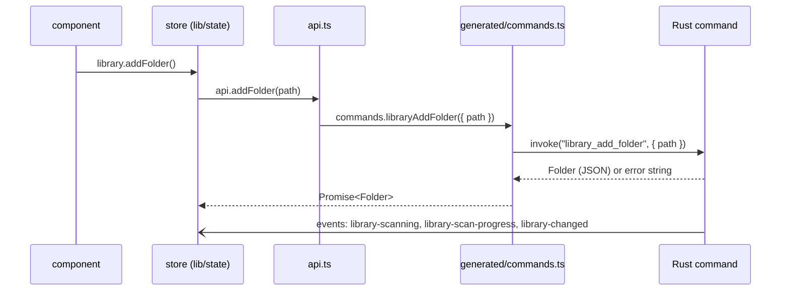
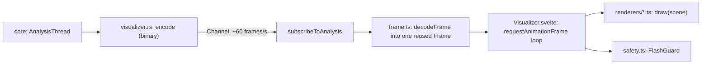

# 7. The frontend

`app/src/` is a Svelte 5 and TypeScript single-page app, built by
SvelteKit's static adapter and loaded by Tauri's webview from the app
itself (no server, no remote content). It shows and asks; it never
reads files, opens network connections or talks to the core. Everything
it knows comes from the backend's commands and events.

If you haven't used Svelte 5: a component is a `.svelte` file with a
`<script>`, markup and scoped styles. State is declared with *runes*:
`$state` (reactive values), `$derived` (values computed from others),
`$effect` (code that reruns when what it reads changes) and `$props`.
A `.svelte.ts` file can use runes outside a component, which is how the
stores in `lib/state/` work.

## Windows and routes

Each window is a route, loaded in its own webview:

| Window (label) | Route | What it is |
|---|---|---|
| `main` | `routes/+page.svelte` | the player: sidebar, browser, queue, playing bar |
| `mini` | `routes/mini/+page.svelte` | the mini player: the playing bar alone (`shell/mini.rs`) |
| `help` | `routes/help/+page.svelte` | the user guide, bundled from `docs/user-guide/` (`shell/help.rs`) |
| (the main window, debug builds only) | `routes/dev/` | the developer page, loaded only when `__DEV_TOOLS__` is true |

`routes/+layout.ts` runs before any page renders, in every window: it
starts logging the page's uncaught errors (`logErrors`), reads the
settings (`appSettings.load()`), and applies the theme, so the first
paint already has both. `routes/+layout.svelte` holds the global styles:
the theme's custom properties and the base look of buttons, inputs and
lists.

The main page (`+page.svelte`) chooses what fills the middle from
`ui.view` (`state/ui.svelte.ts`: the library, Home, an artist's page, a
playlist, Settings…), and adapts to the window: below 900 px the queue
becomes an overlay, below 640 px the sidebar a drawer. It also handles
the `menu` events the menu bar sends, files dropped on the window (which
open in the effects workbench while it shows, X8), and announcing track
changes to screen readers.

Each window has a capability (`app/src-tauri/capabilities/`) that limits
the commands it may call; the mini player and Help windows get only the
few they use.

## State stores

`lib/state/` holds one store per concern, each a class instance with
runes for fields, exported as a singleton:

```ts
// The pattern, from state/player.svelte.ts
class PlayerStore {
  state = $state<PlayerState>("empty");
  connect() {            // follow the backend's events; returns a stop function
    return onAll([
      on("queue-changed", (state) => this.apply(state)),
      on("player-state", (state) => (this.state = state)),
    ]);
  }
}
export const player = new PlayerStore();
```

The main page calls each store's `connect()` when it mounts and the
returned function when it goes. Components read the stores directly
(`player.currentItem`, `library.scanning`), and Svelte re-renders what
read a value when it changes. Two rules keep this fast:

- **Big lists are replaced, never mutated** (`$state.raw`), so Svelte
  compares one reference rather than tracking every row.
- **The position is a store of its own** (`state/position.svelte.ts`),
  updated every 50 ms while playing; only `SeekBar.svelte` reads it, so
  only the seek bar re-renders that often.

The queue's list arrives as numbered edits (H16): each `queue-changed`
that changes the list carries a `listVersion` and either the whole list
or the edits since the previous version. `lib/queueEdits.ts` applies
them to the UI's copy; if a version was missed, the store asks for the
whole state again (`queue_state`).

## Calling the backend



- **`lib/api.ts`** is the only module components and stores import to
  reach the backend. It groups the commands by area (`library`,
  `queue`, `metadata`, `playlists`…) as thin, typed wrappers over
  `generated/commands.ts`, and declares every event and its payload in
  its `Events` map; `on(event, handler)` listens to one, and
  `onAll` stops several together.
- **`lib/generated/`** is written by the Rust tests (chapter 6):
  `commands.ts` has one function per registered command, with its
  arguments in camelCase; `ipc.ts` and `settings.ts` hold every payload
  type. A command renamed in Rust fails `npm run check` here. Never edit
  these files, and never call `invoke` with a string.
- **Errors**: a command's failure rejects its promise. Stores wrap calls
  in `attempt` (`state/toasts.svelte.ts`), which shows the error as a
  toast; text always goes through `errorText` (`lib/i18n`), never
  `String(error)`, so coded errors appear in the user's words.
- **Binary streams**: the visualizer's frames come through a Tauri
  `Channel` (`subscribeToAnalysis`), as `ArrayBuffer`s rather than JSON.
- **Pictures** never go through a command: `artUrl` (`api.ts`) builds an
  `anomp-art:` URL that an `` loads directly, at the size it needs
  (`"list"`, `"header"` or `"full"`).

## Text

Every string the UI shows comes from `lib/i18n/en.json` through `t(key,
params)`: keys are typed from the JSON, so a missing key fails `npm run
check`. Placeholders are `{name}`; a plural message is an object of
`Intl.PluralRules` forms keyed by `{count}`. `errorText` turns a coded
error into its `error.<code>` message (or `error.<code>.<reason>` when
there is one). `tests/i18n.test.mjs` checks every error code Rust sends
has a message. The user guide names controls as `en.json` words them, so
a renamed label is a change to the guide too.

## Themes and styling

Components take every colour, radius and font from CSS custom
properties, never literals. A theme (X1) is a set of token values kept
in the settings; `lib/theme.ts` turns it into custom properties,
`state/appearance.svelte.ts` applies them to `:root` in every window
(through `setProperty`, after validation, never as CSS text), following
the system's light or dark appearance and its request for more
contrast, and taking the accent from the current cover when the theme
asks. The built-in themes are `lib/themes.json` (Rust reads it too);
`tests/contrast.test.mjs` checks every one meets WCAG AA for the pairs
`theme.ts` lists in `PAIRS`. List rows take their height from the
settings' row height.

Settings' sections (`components/settings/`) share one set of styles
(`.field`, `.switch`, `.hint`…) from `settings/Options.svelte`, which
wraps them wherever they show. To show a section outside Settings, wrap
it in `Options`, as the effects workbench (`WorkbenchView.svelte`) does
with Effects and Recording, so each control stays one implementation.

## Lists

A library node can hold 50,000 tracks, so lists are virtual.
`VirtualList.svelte` renders only the rows in view (fixed height), and
reports the rows it needs through `onneed`; `BrowsePane.svelte` fetches
those a page at a time with `library_browse` and keeps the pages it has.
Selection (click, ⌘-click, Shift-click, the arrow keys) is
`lib/selection.ts`, pure and tested; context menus are built by
`trackMenu.ts` and `featureMenu.ts` and shown by `ContextMenu.svelte`;
dragging tracks onto the queue or a playlist uses pointer events
(`state/drag.svelte.ts`), not HTML drag and drop, so it works on touch
screens and doesn't clash with files dropped from the Finder.

## The visualizer



- `Visualizer.svelte` subscribes to the analysis stream while it is
  mounted; the core analyses only while someone is subscribed. Frames
  arrive up to 60 times a second **outside Svelte's reactivity**: each
  is decoded into one reused `Frame` object, and the draw loop
  (`requestAnimationFrame`) reads the latest.
- Each visualization is a plain canvas renderer (`lib/visualizer/types.ts`'s
  `Renderer`), listed in `lib/visualizer/index.ts`. Every frame it gets a
  `Scene`: the 2D context, size, time, the analysis frame, whether a
  beat fell, the cover and a palette taken from it (`palette.ts`), and
  whether calm mode is on.
- `safety.ts` keeps it safe to look at (F18, WCAG 2.3.1): beats reach the
  renderers at most three times a second, and the picture is dimmed
  while its brightness flickers faster than that. Calm mode follows the
  setting or the OS's "reduce motion".
- The musical analysis some renderers need (keys, triads, the Tonnetz,
  tempo, the recurrence plot) is pure TypeScript in `key.ts`, `music.ts`
  and `recurrence.ts`, tested with plain `node --test`.

## Tests and checks

- `npm run check`: svelte-check and TypeScript over everything, including
  the generated types and the message keys.
- `npm run lint`: ESLint (`eslint.config.js`).
- `npm test`: `node --test tests/`, plain `.mjs` files that import the
  pure modules (`lib/*.ts`, `lib/visualizer/*.ts`) as Node runs them;
  components have no unit tests. [Chapter 12](12-testing.md) lists what
  each file covers.
