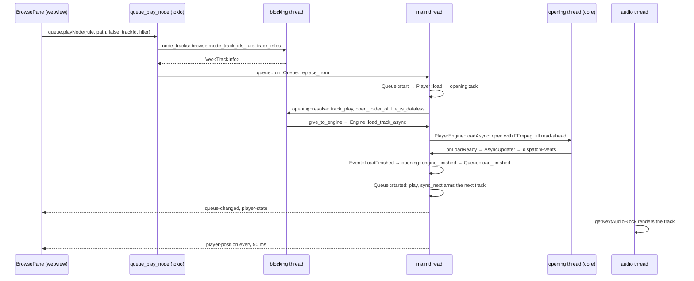
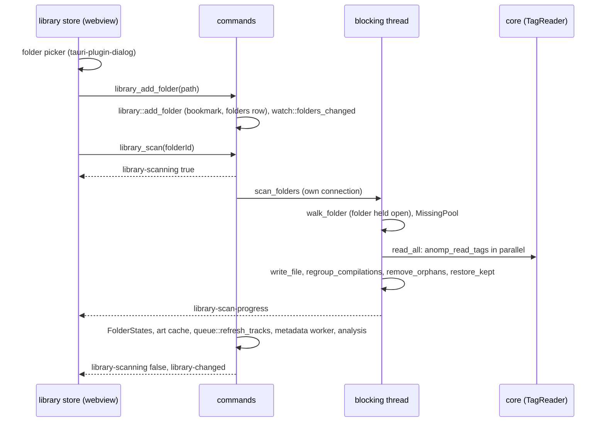
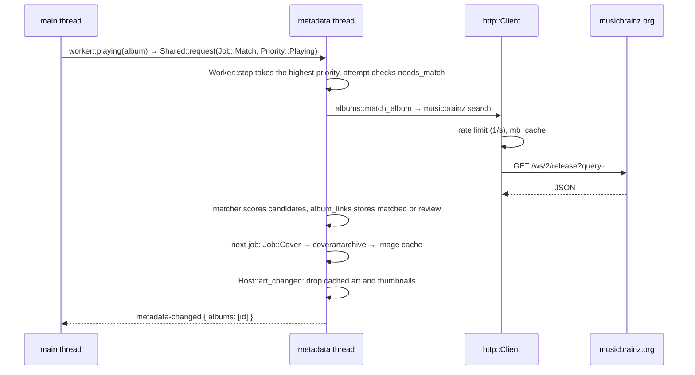
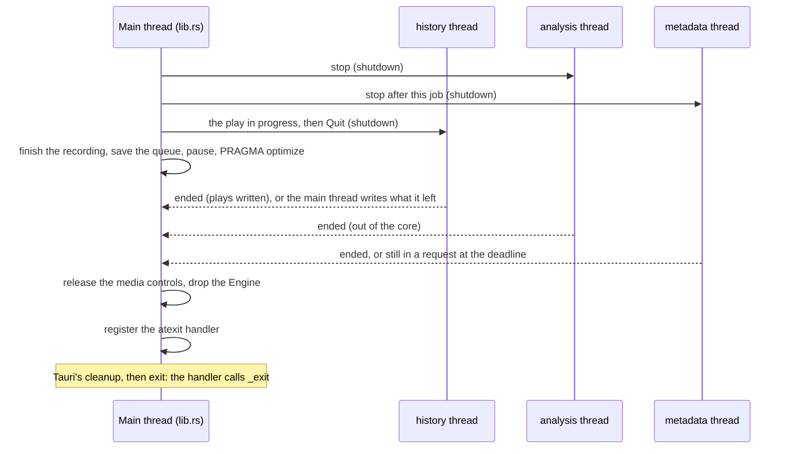

# 8. How things flow

Worked sequences across the layers, each naming the functions in the
order they run, with the thread each runs on. Use them to find where to
look when one step misbehaves: the log lines named in
[Troubleshooting](10-troubleshooting.md) mark the same steps.

Paths are shortened: `queue/mod.rs` is `app/src-tauri/src/queue/mod.rs`,
`BrowsePane.svelte` is in `app/src/lib/components/`.

## Pressing play on a track

The user double-clicks a track in a library view.

1. **Webview.** `BrowsePane.svelte`'s handler calls `queue.playNode`
   (`lib/api.ts`), the wrapper over the generated
   `commands.queuePlayNode`, inside `attempt` so a failure becomes a
   toast.
2. **tokio, then a blocking thread.** `queue_play_node` (`queue/mod.rs`)
   calls `node_tracks`, which on a blocking thread (`on_library`) lists
   the node's track ids under the rule (`browse::node_track_ids_rule`)
   and reads what the queue needs about each (`queue::track_infos`:
   title, album, units, preferences).
3. **Main thread.** `queue::run` borrows the queue and the engine (as an
   `EnginePlayer`) and calls `Queue::replace_from` (`queue/model.rs`):
   the list is replaced (`reset_list`), the current item set, and
   `Queue::start` calls `Player::load`.
4. `EnginePlayer::load` calls `opening::ask` (`queue/opening.rs`), which
   numbers the request and returns `Opening::Pending`: the queue marks
   the item as loading. `run` then publishes: `queue-changed` goes to the
   UI with the item shown as loading.
5. **Blocking thread.** `opening::resolve` reads how to play the track
   (`LibraryState::track_play` → `library::playback`: file, part, gain,
   skip), resolves its folder's bookmark (`open_folder_of`), and checks
   whether the file is a cloud placeholder.
6. **Main thread.** `give_to_engine` calls
   `Engine::load_track_async` (`anomp.rs` → `anomp_engine_load_track_async`
   → `PlayerEngine::loadAsync`) and keeps the `OpenFolder` until the
   engine reports the request.
7. **An opening thread in the core** opens the file
   (`FFmpegAudioFormat`), wraps it in a `BufferingAudioSource` and fills
   its read-ahead, then signals `onLoadReady`.
8. **Main thread.** The `AudioEngine`'s async update calls
   `PlayerEngine::dispatchEvents`, which installs the track and reports
   `ANOMP_EVENT_LOAD_FINISHED`. Rust's `on_event` → `audio.rs`'s handler
   → `queue::on_load_finished` → `opening::engine_finished` (switches the
   device's rate if sample-rate matching is on) → `queue::load_finished`
   → `Queue::load_finished`.
9. `Queue::started` plays (`Player::play`) and `sync_next` arms the next
   track the same way (`Player::set_next` → `opening::ask` with `next`).
   `publish` sends `queue-changed` and `player-state` follows from the
   engine; the media controls, history, recording and metadata worker
   hear of the new current track.
10. **Audio thread.** The device's callback pulls blocks through
    `PlayerEngine::getNextAudioBlock`; every 50 ms the main thread's
    timer dispatches `Position`, which feeds the history's tracker, the
    sleep timer and `player-position` (read only by `SeekBar.svelte`).

If opening fails, `Queue::load_finished` marks the item unavailable and
tries the next one; the UI shows a toast with the coded error. If it
takes longer than `LOAD_TIMEOUT`, `check_loads` fails it.

## A gapless hand-off, and a crossfade

The next track was armed in step 9 above: it is open in the engine,
its read-ahead full.

1. **Audio thread.** As the current track's reader runs out,
   `getNextAudioBlock` continues straight into the next track's samples
   in the same block, at the file's sample rate, before the single
   resampler: no gap, sample for sample. The old track is moved aside
   to be freed later.
2. **Main thread.** At the next dispatch the engine reports
   `ANOMP_EVENT_TRACK_ENDED` with `advanced = 1`, frees the retired
   track, and `queue::on_track_ended` → `Queue::on_track_ended`:
   `reconcile` notices the engine's advance count went up and moves the
   current item on, then `sync_next` arms the following track, from
   inside the event dispatch (which the C API allows).
3. `publish` sends `queue-changed` with the new current item; Now
   Playing, the Dock and notifications follow.

A **crossfade** differs only in step 1. When `sync_next` arms a track
that `crossfades` (different albums, not one unit, the setting on),
`EnginePlayer::set_next` passes `playback.crossfade` seconds in its
`TrackOptions`. Over the current track's last seconds, the player reads
both tracks and mixes them with equal-power curves; the next track takes
over (and `TRACK_ENDED` is reported) as the current one ends, already
that far in. Tracks at different sample rates never crossfade; they
switch at a chunk boundary instead.

If nothing was armed in time (an edit just before the end), the track
ends with `advanced = 0` and `Queue::on_track_ended` starts the following
item with an ordinary load.

## Adding a folder and its scan

1. **Webview.** `library.addFolder` (`state/library.svelte.ts`) opens the
   folder picker, which also grants the sandboxed app access to the
   folder for this session, then calls `api.addFolder`.
2. `library_add_folder` (`library/commands.rs`) → `library::add_folder`
   (`library/mod.rs`): creates a security-scoped bookmark through the
   core (`anomp_bookmark_create`) while access is still granted; a folder
   already in the library only gets the new bookmark (which is how adding
   a folder again repairs its access); otherwise it refuses a folder
   inside or around one already there and inserts the `folders` row. `watch::folders_changed` starts watching it.
3. The store then calls `library_scan` for the new folder →
   `run_scan`: only one scan at a time (a second fails with a coded
   `scanRunning`); `library-scanning` goes out.
4. **Blocking thread.** `scan_folders` opens a connection of its own
   (`db::open`), so browsing stays responsive, and calls
   `scanner::scan_folders`:
   - `walk_folder` opens the folder (`access::open_folder`, held until
     the scan ends), walks it, and compares every audio file's size and
     modification time with its row: new, changed, unchanged, gone;
   - cloud placeholders are recorded without reading them
     (`record_placeholders`);
   - `read_and_write` reads the new and changed files' tags in parallel
     with the core (`anomp::read_tags` → `anomp_read_tags` →
     `TagReader`), splits cue sheets and chapters into parts, and writes
     rows in transactions; a new file that matches one gone (same size
     and time, or recording id, or tags) takes over its row, so track ids
     survive moves (`MissingPool`);
   - finally tracks not found are deleted, unless that would empty the
     folder or remove most of it (`holds`: then the folder fails as
     `Empty` or `MostlyGone` and keeps them); compilations are
     regrouped, orphaned albums and artists removed, and kept picks
     restored. Progress goes out as `library-scan-progress`.
5. **Back in `run_scan`.** Each folder's state is recorded
   (`FolderStates`), the art cache cleared, the queue's titles refreshed
   (`queue::refresh_tracks`), new albums queued for the metadata worker
   (`worker::enrich_library`) and new tracks for the analysis
   (`analysis::library_changed`); then `library-changed`.
6. **Webview.** The library store bumps its `version` and refreshes, so
   every view reloads; the sidebar's folder list updates.

The same `run_scan` serves the launch rescan and file watching
(`library/watch.rs`, `background = true`, at a lower priority).

## A search keystroke

1. **Webview.** `Header.svelte`'s search box sets `library.query`;
   `SearchResults.svelte` waits until typing stops for 150 ms, then
   calls `api.library.search(query, kinds, offset, limit)`. A result that
   arrives for an older query is dropped.
2. `library_search` (`library/commands.rs`) runs `search::search` on a
   blocking thread with the shared connection.
3. `library/search.rs` parses the query into words and field filters
   (`artist:`, `album:`…), folds case and accents, and for each kind
   (artists, albums, tracks) builds one query over the FTS5 indexes:
   each word must match the start of a word in the word index
   (`tracks_search`…) or, from three characters, anywhere in the trigram
   index (`tracks_trigram`…); start-of-word matches rank first. Values
   are bound, never formatted into the SQL.
4. The grouped results return as `SearchResults`; covers load from
   `anomp-art:` URLs as the rows render.

`scripts/bench.py --only rust` times this on 50,000 tracks; run it after
changing the search SQL.

## An album's details arriving from MusicBrainz

The album playing has never been looked up.

1. **Main thread.** `queue::publish` calls `metadata::worker::playing`
   with the current album, which queues `Job::Match(album)` at
   `Priority::Playing` (`worker::Shared::request` only takes a lock and
   wakes the worker; it never waits).
2. **Metadata thread.** `Worker::step` (`metadata/jobs.rs`) takes the
   highest-priority job. `attempt` checks it is still wanted: "match
   automatically" is on, the album still exists, and `needs_match` (not
   matched, not chosen by the user, not tried recently).
3. `albums::match_album` (`metadata/albums.rs`) uses the release MBID in
   the tags if there is one; otherwise it searches MusicBrainz
   (`musicbrainz.rs`) by title and artist through `http::Client`, which
   waits for the host's rate limit and keeps the response in `mb_cache`.
   `matcher.rs` scores each release against the album's facts (artist,
   year, track count, durations); the best is stored in `album_links` as
   `matched` if its score clears the bar, `review` if it is close, or
   `none`.
4. The job returns its follow-up, run at once: `Job::Cover` fetches the
   front cover from the Cover Art Archive into the image cache
   (`coverartarchive.rs`, `images.rs`), then `Job::Description` (the
   release group's Wikipedia article) and the Discogs match when they
   are wanted.
5. `Host::art_changed` (`metadata/worker.rs`) drops the album's cached art
   and thumbnails (`thumbs::forget`); the changes are flushed as
   `metadata-changed` (at once for the album playing; batched a second
   apart in background runs), and `media::art_changed` republishes Now
   Playing's artwork.
6. **Webview.** The library store bumps the album's art version, so every
   `artUrl` for it changes and the ``s reload; `AlbumInfo.svelte`
   reloads its details (`metadata_album`).

Offline, `http::Client` marks the host unreachable; automatic jobs for
it wait in the queue and `Worker::step` says when to try again.

## A setting changed in the UI

The user switches ReplayGain to "album" in Settings › Playback.

1. **Webview.** `PlaybackOptions.svelte` calls `appSettings.save(next =>
   …)` (`state/settings.svelte.ts`), which copies the current settings,
   applies the edit and sends the whole value: `settings_save`.
2. `settings_save` (`settings.rs`) validates the whole `AppSettings`
   (`validate`): a value out of range fails with an error and nothing
   changes. If the output device changed it is opened first; failing,
   the previous device is reopened and nothing is saved.
3. The value is stored as JSON under `app` in `settings`, `SettingsState`
   is replaced, and `settings-changed` goes to every window.
4. Then each changed part is applied: here `playback` changed, so
   `queue::refresh_gains` → `queue::run` → for each track the engine has
   open, `EnginePlayer::refresh_gain`: a new `track_play`, its gain under
   the new settings, and `Engine::set_track_gain_at` (by file and
   start), which the player ramps to over the next block. Others: the
   equaliser (`audio::apply_equaliser`), effects (`effects::apply`), the
   watcher, window settings, the visualizer's rate, and for feature
   switches the analysis, remote, updates, history, recording, the
   queue's units, and a full re-read when cue sheets are switched.
5. **Webview.** `save` resolves with the stored settings; every window's
   settings store already has them from `settings-changed`.

## Quitting

1. ⌘Q (or the Dock's Quit) ends Tauri's run loop, which sends
   `RunEvent::Exit` on the main thread (`lib.rs`). When the handler
   returns, Tauri ends the process with `std::process::exit`, whatever
   other threads are doing, so the handler waits for the ones with
   something to finish (`quitting.rs`), up to a deadline taken first:
   `quitting::WAIT`, one second for all of them together.
2. Told to stop, in order: the remote stops listening; the update
   checker ends (it writes nothing); the analysis stops, giving up the
   track it is on at its next progress report, a quarter of a second at
   most, without storing it; the metadata worker stops after the job it
   is on; the history tracker sends how long the play in progress was
   listened to, then `Quit` (`history::shutdown`).
3. On the main thread: a recording is finished and its file finalised
   (`recording::shutdown`); the queue notes the position and saves
   itself (`queue::shutdown`: positions of long tracks, the
   `player.queue` setting and rows); playback is paused, so nothing
   plays on while the threads are waited for; the library runs
   `PRAGMA optimize`.
4. Waited for until the deadline: the history thread, which writes
   everything waiting before each ListenBrainz request; if it is still
   in one at the deadline, `history::wait` takes what it left from the
   shared receiver and writes it with the library's connection (a
   `Listened` names its play by track and start, so any connection can
   update it);
   the analysis thread, so that results it finished are stored; the
   metadata worker, which may
   be in a request (up to 30 s): at the deadline it is left, and
   `quitting` logs "metadata still running at quit". What it loses is
   unfinished work, which background enrichment queues again at the
   next launch: its writes are single statements, and pictures are
   renamed into place.
5. Then the volume watcher, the Dock menu and the media controls are
   released, and `audio::shutdown` drops the `Engine`:
   `anomp_engine_destroy` stops the device, frees the tracks and shuts
   JUCE down, on the main thread, while the run loop still exists.
6. Last, `quitting::skip_static_destructors` registers an `atexit`
   handler. Tauri then does its own cleanup (and, after a database
   restore or rebuild, starts the app again) and calls `exit`. Handlers
   run in reverse order of registration, so ours runs before the C++
   static destructors (the core's format registry, TagLib's and JUCE's
   singletons): it flushes the log and calls `_exit`. A thread still
   inside the core, such as a scan reading tags or a cover being read,
   is never left running over destroyed objects, which could otherwise
   crash the quit.

Not waited for, as nothing of theirs is lost: the update checker; the
remote's threads; the library watcher and a scan in progress, whose
batches are transactions (a cut one rolls back, and the launch's rescan
does it again).

Closing the main window is not quitting: on macOS it hides the window
and the music plays on (`lib.rs`'s `on_window_event`).
