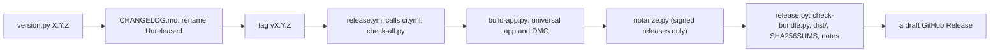

# 13. Building and releasing

How a release is built, checked and published, and what each script in
the chain checks. The plan for releases (the gates that must hold before
any public release, the decisions the owner still has to make, signing,
distribution and the checklist for every release) is `PLAN.md` §8; this
chapter is the map from those steps to the code.

## The pipeline

`.github/workflows/release.yml` runs on a `v*` tag, or by hand for a
trial. It calls the CI workflow first (which runs `scripts/check-all.py`
and nothing else), then builds, notarizes and collects the files, and
drafts a GitHub Release for the owner to publish. Every check lives in a
script, never in the workflow, so the same command runs on a laptop.
Steps that need the Developer ID secrets are named "[signed releases]"
and are skipped without them: until the owner's signing decisions are
made (`docs/release-decisions.md`), a release run produces an ad-hoc
signed trial build.

## The scripts, in order

| Script | Does | Checks |
|---|---|---|
| `scripts/version.py X.Y.Z` | sets the version everywhere a tool needs it: CMake's `project(VERSION)` (the source of truth, compiled into `anomp_version()`), `Cargo.toml` and `Cargo.lock`, `tauri.conf.json`, `package.json` and `package-lock.json` | `--check` (in `check-all.py`): every copy agrees; `--tag` also that the tag names that version |
| `CHANGELOG.md` | release notes, Keep a Changelog style: add to `## [Unreleased]` as you go, rename it when tagging | `release.py` fails if the version's section is missing or empty |
| `scripts/make-notices.py` | regenerates `THIRD_PARTY_NOTICES` (bundled, shown in Settings › About): JUCE and what it vendors, FFmpeg and LAME from `BUILD_INFO`, TagLib, Signalsmith, every Rust crate and bundled npm package | `--check` (in `check-all.py`): the committed file is current; every licence is in `deny.toml`'s allowed list |
| `scripts/build-app.py` | builds the universal (arm64 and x86_64) `.app` and DMG with Tauri; `--native` for this Mac only | with a signing identity, signs with it and turns the hardened runtime on; without, ad-hoc signs with it off |
| `scripts/check-bundle.py` | — | both architectures in the executable and every FFmpeg library; FFmpeg's frameworks exactly as `tauri.conf.json` names them, found through the bundle's rpath and nothing outside it; signatures (`--signed`: one Developer ID team, hardened runtime); entitlements exactly `Entitlements.plist`'s; the notices, version and minimum macOS |
| `scripts/notarize.py` | submits a Developer ID-signed DMG to Apple's notary service, waits, staples the ticket | refuses an ad-hoc signed file; checks the ticket and Gatekeeper's verdict; without the `NOTARY_*` keys it prints its plan and changes nothing |
| `scripts/release.py BUNDLE_DIR` | collects `dist/`: the DMG, the app zipped with `ditto`, `SHA256SUMS`, and the release notes (RELEASE_NOTES.md) cut from the changelog | runs `check-bundle.py` first and stops if it fails; `--tag` checks the tag against the version |
| `scripts/self-test-bundle.py` | builds a sandboxed bundle with the `self-test` feature and runs `ano-mp --self-test` | scanning, bookmarks, covers, decoding and a gapless hand-off inside the sandbox (CI only, unless `--local`) |
| `scripts/bench.py` | runs the benchmarks | H18's budgets; a release step (`PLAN.md` §8.7), not part of `check-all` |

## The bundle's settings

- **`app/src-tauri/tauri.conf.json`**: the bundle identifier (the
  owner's, `docs/release-decisions.md`), the version, the minimum macOS,
  `bundle.macOS.frameworks` (FFmpeg's libraries by major version: update
  it when the FFmpeg pin changes), file associations, the resources
  (`THIRD_PARTY_NOTICES`), the webview's CSP, and the ad-hoc signing
  local builds use.
- **`app/src-tauri/Entitlements.plist`**: the App Sandbox, user-selected
  files read-write (folders the user picks), security-scoped bookmarks,
  and network access (client, and server for the LAN remote).
- **`app/src-tauri/Info.plist`**: added to the generated one: why the
  app asks for the local network (`NSLocalNetworkUsageDescription`, for
  the LAN remote).
- **FFmpeg** is embedded as shared libraries in `Contents/Frameworks`,
  replaceable as the LGPL requires; only debug builds have an rpath into
  `third_party/`.

## Between releases

These run on a schedule or by hand; none changes the app by itself:

| Script | When | What |
|---|---|---|
| `scripts/check-pins.py` | weekly (`audit.yml`) | every pinned dependency with a newer release, with `cargo update` and `npm outdated` |
| `scripts/bump-pin.py NAME VERSION` | by hand | downloads, hashes (FFmpeg: GPG-checks) and rewrites a pin; `--check` shows the diff |
| `scripts/audit-deps.py` | weekly (`audit.yml`) | `cargo deny`, `npm audit`, and the FFmpeg pin against ffmpeg.org's security page |
| `scripts/check-signing.py` | monthly, once certificates exist | signing certificates' expiry |
| `scripts/record-fixtures.py --check` | by hand | the services' recorded responses against what they answer now |
| `.github/workflows/fuzz.yml` | weekly | each fuzz target for 30 minutes |

Dependabot proposes updates to the GitHub Actions (pinned by commit SHA),
Cargo and npm monthly; CI runs on such a branch by hand before merging
(README, "When GitHub Actions run"). Updating a dependency regenerates
`THIRD_PARTY_NOTICES` in the same commit.
